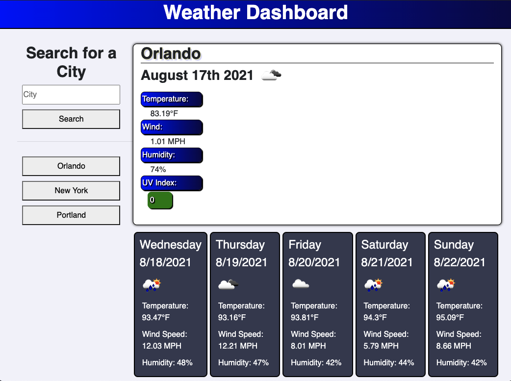

# Weather Dashboard

## Description
Weather Dashboard is a web application used to find the weather forecast for various cities. Open Weather Map API is used to gather data for temperature, wind, humidity, UV index, and weather condition icons. The UV index changes color based on favorable, moderate, or severe conditions. City searches are saved as buttons that can be clicked to rerun a search.

## Built With
* HTML
* CSS
* Javascript
* Moment
* Bootstrap
* Open Weather Map API

## Website
https://wamackie.github.io/weather-dashboard/

## Credits
Weather Dashboard was created by William Mackie
